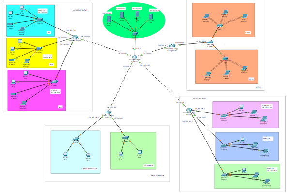
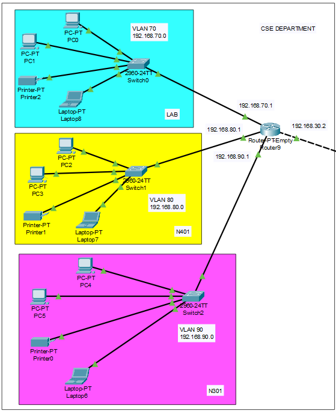
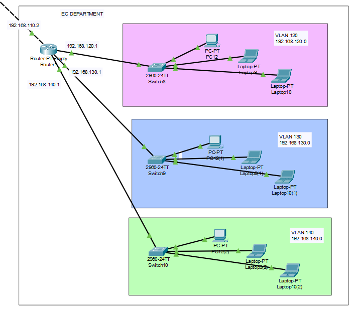
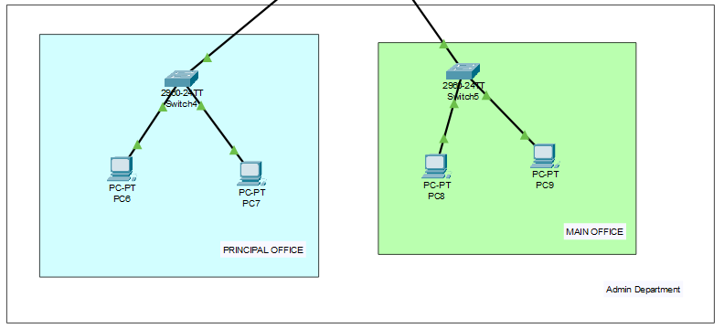
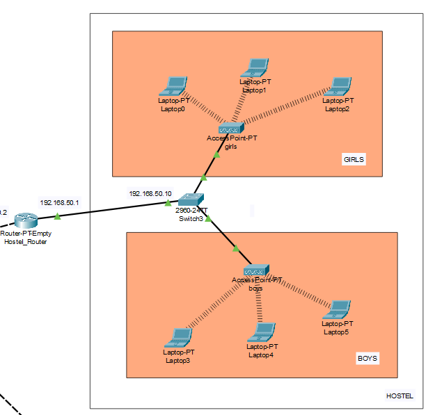

# University Campus Area Network Project

This project simulates a **University Campus Area Network** in Cisco Packet Tracer, utilizing VLANs, RIP v2, DHCP, and various network services like DNS, Web, and Email servers. The network is designed to demonstrate effective segmentation, inter-VLAN routing, and service integration within a simulated university environment.

## Project Overview

The main objective of this project is to create a scalable and secure network that accommodates various departments within a university. Each department is assigned a unique VLAN, with specific services accessible to users based on their VLAN. The network also integrates essential protocols and services to ensure smooth communication and connectivity across the campus.

## Features

- **VLAN Configuration**: Network segmentation into multiple VLANs for departments like Administration, Academics, Students, and Guest.
- **RIPv2 Routing**: Configured RIPv2 for dynamic routing between VLANs and to enable efficient inter-VLAN communication.
- **DHCP**: Centralized DHCP server to automatically assign IP addresses to devices within each VLAN.
- **DNS Server**: Provides domain name resolution services within the network.
- **Web Server**: Hosts the university's website, accessible from all VLANs.
- **Email Server**: Facilitates internal email communication within the university network.

## Network Design

The network topology is designed with the following key components:

1. **Access Layer Switches**: Connects end devices within each VLAN.
2. **Routers**: Configured with RIPv2 to manage routing between the campus and external networks.
3. **Servers**:
   - **DHCP Server**: Assigns IP addresses dynamically to devices within each VLAN.
   - **DNS Server**: Resolves domain names for internal and external network access.
   - **Web Server**: Hosts the university's official website.
   - **Email Server**: Provides email services for internal communication.

## VLAN Configuration

| VLAN ID  | Department     | Purpose                    |
|----------|----------------|----------------------------|
| 40       | Administration | Administrative Network     |
| 120,130  | EC Academics   | EC Academic Resources      |
| 70,80,90 | CSE  Students  | CSE Student Network Access |
| 50       | Hostel         | Hostel Network Access      |

Each VLAN is assigned a unique subnet and IP range for network segmentation and efficient IP management.

## Protocols and Services

- **RIP v2**: Configured on routers for dynamic routing within the campus network.
- **DHCP**: Provides automatic IP address assignment to devices.
- **DNS**: Resolves domain names, enabling users to access network resources by hostname.

## Home

## CSE Department

## EC Department

## Admin Department

## Hostel Department

